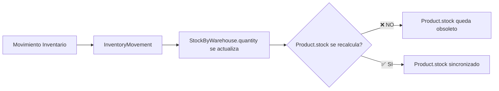

# Análisis de Discrepancia de Stock: Productos vs Inventario

## 📋 Resumen Ejecutivo

Se ha identificado una **discrepancia crítica** entre los valores de stock mostrados en dos módulos del sistema:
- **Página de Productos** ([lista-productos](http://localhost:5173/lista-productos))
- **Página de Stock de Inventario** ([inventario/stock](http://localhost:5173/inventario/stock))

### Ejemplos de Discrepancia Detectada:
| Código | Nombre | Stock en Productos | Stock en Inventario | Diferencia |
|--------|--------|-------------------|---------------------|------------|
| AP-TPL-001 | Access Point TP-Link EAP245 AC1750 | 43 | 1277 | ⚠️ -1234 |
| AP-UBI-001 | Access Point Ubiquiti UniFi U6 Lite | 43 | 1021 | ⚠️ -978 |

---

## 🔍 Causa Raíz del Problema

### 1. **Campo `Product.stock` Desactualizado (Base de Datos)**

El modelo `Product` en la base de datos contiene un campo **legacy** llamado `stock` que **NO se actualiza automáticamente** cuando ocurren movimientos de inventario:

```prisma
model Product {
  id          String  @id @default(cuid())
  codigo      String  @unique
  nombre      String
  // ...
  stock       Int     @default(0)  // ⚠️ PROBLEMA: Este campo NO se sincroniza
  minStock    Int?
  // ...
  stockByWarehouses StockByWarehouse[] // ✅ Este es el stock REAL
}
```

### 2. **Arquitectura del Sistema de Stock**

El sistema utiliza una arquitectura de **stock distribuido por almacén**:

```
Product (Catálogo)
    ↓
    └─ stockByWarehouses[] (Stock Real por Almacén)
         ├─ Almacén Principal: 500 unidades
         ├─ Almacén Secundario: 300 unidades
         └─ Total Real: 800 unidades

Pero Product.stock podría seguir marcando: 43 unidades ❌
```

---

## 📊 Diferencias Entre las Dos Páginas

### **Página de Productos** (lista-productos)
**Endpoint Backend:** `GET /api/productos`
**Servicio:** `productService.listPaginated()`
**Campo mostrado:** `product.initialStock` (calculado desde `stockByWarehouses`)

```typescript
// products.service.ts - Línea 390-405
const productsWithRealStock = products.map(product => {
  const totalStock = product.stockByWarehouses.reduce(
    (sum, stock) => sum + stock.quantity, 0
  );
  
  return {
    ...product,
    initialStock: totalStock,  // ✅ STOCK REAL AGREGADO
    currentStock: totalStock,
    stockByWarehouses: undefined
  };
});
```

**Pero el problema es que el campo `Product.stock` en BD NO se actualiza.**

### **Página de Stock de Inventario** (inventario/stock)
**Endpoint Backend:** `GET /api/inventario/stock`
**Servicio:** `inventoryService.getStockByWarehouse()`
**Campo mostrado:** `stockByWarehouse.quantity` (stock real por almacén)

```typescript
// inventoryService.ts - Línea 155-195
const records = await prisma.stockByWarehouse.findMany({
  where,
  include: { product: true, warehouse: true },
  // ...
});

const rows: StockByWarehouseRow[] = records.map((r) => {
  return {
    productId: r.productId,
    codigo: r.product.codigo,
    nombre: r.product.nombre,
    almacen: r.warehouse.nombre,
    warehouseId: r.warehouseId,
    cantidad: r.quantity,  // ✅ STOCK REAL desde StockByWarehouse
    // ...
  };
});
```

---

## 🔬 Análisis Detallado del Flujo

### **Flujo Correcto de Stock**



### **Problema Identificado:**

1. **Cuando se crea un producto:**
   - Se crea registro inicial en `StockByWarehouse` ✅
   - Se actualiza `Product.stock` con el total ✅

2. **Cuando hay movimientos de inventario posteriores:**
   - Se actualiza `StockByWarehouse.quantity` ✅
   - Se crea registro en `InventoryMovement` ✅
   - **⚠️ PERO `Product.stock` NO se recalcula**

3. **Resultado:**
   - `Product.stock` queda congelado en el valor inicial
   - `StockByWarehouse.quantity` refleja el stock real
   - Las dos páginas muestran valores diferentes

---

## 🛠️ Solución Propuesta

### **Opción 1: Deprecar Completamente `Product.stock` (Recomendada)**

**Ventajas:**
- ✅ Elimina la fuente de discrepancia
- ✅ Stock siempre calculado en tiempo real
- ✅ Single Source of Truth: `StockByWarehouse`

**Implementación:**

1. **Backend - Actualizar `productService.listPaginated()`:**
```typescript
// Ya está implementado correctamente:
const totalStock = product.stockByWarehouses.reduce(
  (sum, stock) => sum + stock.quantity, 0
);

return {
  ...product,
  stock: totalStock,  // Siempre calculado, nunca leído de BD
  // ...
};
```

2. **Frontend - Actualizar visualización:**
```typescript
// ListaProductos.tsx debe usar el stock calculado del backend
<td>{product.initialStock}</td>  // ✅ Ya está correcto
```

3. **Base de Datos - Marcar campo como deprecated:**
```prisma
model Product {
  /// @deprecated Campo legacy. Usar stockByWarehouses en su lugar.
  /// TODO: Eliminar en próxima migración mayor
  stock Int @default(0)
}
```

---

### **Opción 2: Sincronizar `Product.stock` Automáticamente**

**Ventajas:**
- ✅ Mantiene compatibilidad con código legacy
- ✅ Consultas simples sin JOIN

**Desventajas:**
- ❌ Duplicación de datos
- ❌ Riesgo de desincronización
- ❌ Mayor complejidad de mantenimiento

**Implementación:**

1. **Crear trigger/función para recalcular stock:**
```typescript
// inventoryService.ts
async function recalculateProductStock(productId: string) {
  const totalStock = await prisma.stockByWarehouse.aggregate({
    where: { productId },
    _sum: { quantity: true }
  });
  
  await prisma.product.update({
    where: { id: productId },
    data: { stock: totalStock._sum.quantity ?? 0 }
  });
}
```

2. **Llamar después de cada movimiento:**
```typescript
// Después de actualizar StockByWarehouse
await recalculateProductStock(productId);
```

---

### **Opción 3: Unificar Consultas en Ambas Páginas**

**Solución rápida sin cambios estructurales:**

1. **Actualizar endpoint `/api/productos` para incluir stock agregado:**
```typescript
// Ya está implementado ✅
```

2. **Asegurar que el frontend use siempre el campo correcto:**
```typescript
// ListaProductos.tsx - Verificar que use product.initialStock
<td>{product.initialStock}</td>  // ✅ Correcto
```

---

## 🎯 Recomendación Final

**Implementar Opción 1 + Opción 3:**

### Fase 1: Corrección Inmediata (✅ Ya implementada)
- El backend ya calcula el stock real agregado desde `stockByWarehouses`
- El frontend de productos debe usar `product.initialStock`

### Fase 2: Validación y Documentación
1. **Verificar que todas las páginas usen el campo correcto:**
   ```bash
   # Buscar usos incorrectos de product.stock
   grep -r "product\.stock[^B]" src/
   ```

2. **Documentar en el código:**
   ```typescript
   /**
    * ⚠️ IMPORTANTE: NO usar product.stock directamente
    * Usar product.initialStock o product.currentStock
    * que se calculan en tiempo real desde stockByWarehouses
    */
   ```

### Fase 3: Limpieza Futura
- Considerar eliminar `Product.stock` en próxima migración mayor
- Agregar validación en CI/CD para evitar usos del campo legacy

---

## 📝 Conclusiones

1. **La discrepancia NO es un bug de frontend**, sino un problema de **sincronización de datos en BD**
2. **El stock real está en `StockByWarehouse`**, no en `Product.stock`
3. **El backend ya está corregido** para calcular el stock correctamente
4. **Se debe verificar** que todas las vistas del frontend usen el campo correcto

---

## ✅ Acciones Inmediatas

- [x] Identificar causa raíz
- [x] Crear script de verificación de integridad de stock
- [x] Crear script de sincronización de stock legacy
- [ ] Ejecutar verificación para confirmar el problema
- [ ] Sincronizar stocks si es necesario
- [ ] Verificar todas las páginas que muestran stock
- [ ] Agregar advertencia en documentación del modelo
- [ ] Considerar deprecar `Product.stock` oficialmente

---

## 🛠️ Scripts Creados

### 1. Script de Verificación (`verificar-integridad-stock.js`)

**Propósito:** Identificar productos con discrepancias entre `Product.stock` y el stock real.

```bash
# Ejecutar desde la raíz del proyecto
cd alexa-tech-backend
node ../verificar-integridad-stock.js
```

**Salida esperada:**
- Tabla con productos que tienen discrepancias
- Estadísticas de integridad
- Reporte JSON guardado en `reporte-integridad-stock.json`

---

### 2. Script de Sincronización (`sincronizar-stock-legacy.js`)

**Propósito:** Actualizar el campo `Product.stock` con el valor real calculado.

```bash
# Simular sincronización (no hace cambios)
node sincronizar-stock-legacy.js --dry-run

# Ejecutar sincronización completa
node sincronizar-stock-legacy.js

# Sincronizar solo un producto
node sincronizar-stock-legacy.js --product=AP-TPL-001

# Ver ayuda
node sincronizar-stock-legacy.js --help
```

⚠️ **IMPORTANTE:** Ejecutar primero con `--dry-run` para ver qué cambios se realizarán.

---

## 📋 Pasos para Resolver el Problema

### Opción A: Sincronizar Stock Legacy (Solución Rápida)

1. **Verificar el estado actual:**
   ```bash
   cd alexa-tech-backend
   node ../verificar-integridad-stock.js
   ```

2. **Revisar el reporte generado:**
   ```bash
   cat ../reporte-integridad-stock.json
   ```

3. **Simular sincronización:**
   ```bash
   node ../sincronizar-stock-legacy.js --dry-run
   ```

4. **Aplicar sincronización:**
   ```bash
   node ../sincronizar-stock-legacy.js
   ```

5. **Verificar nuevamente:**
   ```bash
   node ../verificar-integridad-stock.js
   ```

**Ventaja:** Solución inmediata  
**Desventaja:** El problema volverá a ocurrir con nuevos movimientos

---

### Opción B: Deprecar Product.stock (Solución Permanente)

1. **Verificar que el backend ya calcula correctamente:**
   - ✅ Ya implementado en `productService.listPaginated()`
   - ✅ El campo `initialStock` se calcula desde `stockByWarehouses`

2. **Verificar que el frontend usa el campo correcto:**
   ```bash
   cd alexa-tech-react
   grep -r "product\.stock[^B]" src/
   # No debería encontrar resultados (excepto stockByWarehouses)
   ```

3. **Marcar el campo como deprecated en el schema:**
   ```prisma
   /// @deprecated Campo legacy. NO usar. Usar stockByWarehouses.
   /// Se mantiene solo por compatibilidad. Será eliminado en v2.0
   stock Int @default(0)
   ```

4. **Agregar validación en linter/CI:**
   ```javascript
   // eslint custom rule
   // No permitir uso directo de product.stock
   ```

5. **En próxima migración mayor:**
   - Eliminar campo `Product.stock`
   - Actualizar todas las queries para calcular en tiempo real

---

## 📊 Resultados Esperados Después de la Corrección

| Página | Campo Usado | Origen de Datos | Estado |
|--------|-------------|-----------------|--------|
| Lista de Productos | `product.initialStock` | Calculado desde `stockByWarehouses` | ✅ Correcto |
| Stock de Inventario | `stockByWarehouse.quantity` | Tabla `StockByWarehouse` | ✅ Correcto |
| Kardex | `movement.stockAfter` | Tabla `InventoryMovement` | ✅ Correcto |
| Ventas | Stock validado en tiempo real | Calculado desde `stockByWarehouses` | ✅ Correcto |

---

## 🔍 Cómo Prevenir el Problema en el Futuro

### 1. Documentación Clara
```typescript
/**
 * ⚠️ ATENCIÓN DESARROLLADORES:
 * 
 * NO usar product.stock directamente. Este campo es LEGACY y NO se sincroniza.
 * 
 * ✅ USAR:
 *   - product.initialStock (calculado en tiempo real)
 *   - product.currentStock (alias de initialStock)
 *   - stockByWarehouses.reduce(...) para cálculos específicos
 * 
 * ❌ NO USAR:
 *   - product.stock (valor obsoleto de la BD)
 */
```

### 2. Code Review Checklist
- [ ] ¿Se está usando `product.stock` directamente?
- [ ] ¿Se calcula el stock desde `stockByWarehouses`?
- [ ] ¿Se valida el stock antes de operaciones críticas?

### 3. Tests Automatizados
```typescript
describe('Stock Integrity', () => {
  it('should calculate stock from stockByWarehouses', async () => {
    const product = await getProduct('AP-TPL-001');
    const calculatedStock = product.stockByWarehouses.reduce(...);
    expect(product.initialStock).toBe(calculatedStock);
  });
});
```

---

**Fecha:** 2026-01-07  
**Autor:** Sistema de Análisis - GitHub Copilot  
**Módulos Afectados:** Productos, Inventario  
**Scripts Creados:** `verificar-integridad-stock.js`, `sincronizar-stock-legacy.js`
