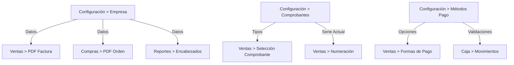

# 📊 ANÁLISIS COMPLETO DEL MÓDULO DE CONFIGURACIÓN

**Fecha de Análisis:** 20 de Noviembre de 2025  
**Autor:** GitHub Copilot  
**Estado del Módulo:** ✅ OPERATIVO CON ÁREAS DE MEJORA

---

## 📋 ÍNDICE

1. [Resumen Ejecutivo](#resumen-ejecutivo)
2. [Arquitectura del Módulo](#arquitectura-del-módulo)
3. [Análisis de Componentes](#análisis-de-componentes)
4. [Integración con el Sistema](#integración-con-el-sistema)
5. [Seguridad y Permisos](#seguridad-y-permisos)
6. [Problemas Detectados](#problemas-detectados)
7. [Recomendaciones](#recomendaciones)
8. [Impacto en Otros Módulos](#impacto-en-otros-módulos)

---

## 🎯 RESUMEN EJECUTIVO

### Estado General
El módulo de Configuración está **funcionalmente operativo** pero presenta **inconsistencias arquitectónicas** que afectan la mantenibilidad y escalabilidad del sistema.

### Calificación por Categorías
| Categoría | Calificación | Comentario |
|-----------|--------------|------------|
| **Funcionalidad** | ⭐⭐⭐⭐ (4/5) | Cumple su propósito principal |
| **Arquitectura** | ⭐⭐⭐ (3/5) | Inconsistencias con otros módulos |
| **Seguridad** | ⭐⭐⭐⭐⭐ (5/5) | Permisos bien implementados |
| **Integración** | ⭐⭐ (2/5) | Poca integración real con módulos operativos |
| **UX/UI** | ⭐⭐⭐⭐ (4/5) | Interfaz consistente y funcional |

---

## 🏗️ ARQUITECTURA DEL MÓDULO

### Estructura de Archivos

```
alexa-tech-react/src/modules/configuracion/
├── index.ts                          # ✅ Exportaciones centralizadas
├── context/
│   └── ConfiguracionContext.tsx      # ⚠️ Context básico, poco utilizado
├── pages/
│   ├── MiPerfil.tsx                  # ❌ Solo re-exporta PerfilUsuario
│   ├── Empresa.tsx                   # ✅ Componente completo
│   ├── Comprobantes.tsx              # ✅ CRUD completo
│   └── MetodosPago.tsx               # ✅ CRUD completo
└── services/
    └── configuracionApi.ts           # ✅ Servicio API centralizado

alexa-tech-backend/src/modules/configuracion/
├── configuracion.routes.ts           # ✅ Rutas RESTful
├── configuracion.controller.ts       # ✅ Controlador con validaciones
├── configuracion.service.ts          # ✅ Lógica de negocio
└── configuracion.types.ts            # ✅ Tipado TypeScript
```

### Base de Datos (Prisma Schema)

```prisma
model Company {
  id              String   @id @default(cuid())
  ruc             String   @unique
  razonSocial     String
  nombreComercial String
  direccion       String
  telefono        String
  email           String
  website         String?
  logo            String?
  igvActivo       Boolean  @default(true)
  igvPorcentaje   Decimal  @default(18)
  moneda          String   @default("PEN")
  pais            String   @default("Perú")
  // ... SUNAT config
}

model ComprobanteType {
  id             String   @id @default(cuid())
  codigo         String   @unique
  nombre         String
  tipo           String   // factura, boleta, nota-credito, nota-debito
  serie          String
  numeroActual   Int      @default(1)
  numeroInicio   Int      @default(1)
  numeroFin      Int      @default(99999)
  activo         Boolean  @default(true)
  predeterminado Boolean  @default(false)
}

model PaymentMethodConfig {
  id                 String   @id @default(cuid())
  codigo             String   @unique
  nombre             String
  tipo               String   // Efectivo, Tarjeta, Transferencia, etc.
  activo             Boolean  @default(true)
  predeterminado     Boolean  @default(false)
  requiereReferencia Boolean  @default(false)
}
```

---

## 🔍 ANÁLISIS DE COMPONENTES

### 1️⃣ Mi Perfil (`MiPerfil.tsx`)

**Código Actual:**
```tsx
import PerfilUsuario from '../../users/pages/PerfilUsuario';
export default PerfilUsuario;
```

**Análisis:**
- ❌ **Problema Crítico:** No es una página de configuración real
- ❌ Solo un alias/redirect a `PerfilUsuario` del módulo de usuarios
- ❌ Rompe la separación de módulos
- ❌ Genera confusión en la arquitectura

**Impacto:**
- El usuario accede a la misma página desde dos rutas diferentes (`/usuarios/perfil` y `/configuracion/mi-perfil`)
- No hay configuración específica del perfil en este componente

**Recomendación:**
```tsx
// OPCIÓN 1: Eliminar completamente y solo usar /usuarios/perfil
// OPCIÓN 2: Crear una vista específica de configuración de perfil
const MiPerfil: React.FC = () => {
  return (
    <Layout title="Mi Perfil - Configuración">
      <ConfiguracionPerfilUsuario /> {/* Componente específico */}
      <ConfiguracionNotificaciones />
      <ConfiguracionPrivacidad />
    </Layout>
  );
};
```

---

### 2️⃣ Empresa (`Empresa.tsx`)

**Funcionalidad:** ✅ Completamente funcional

**Características:**
- ✅ Formulario completo con validaciones
- ✅ Modo edición/vista separado
- ✅ Integración con backend
- ✅ Manejo de errores
- ✅ Configuración SUNAT (SOL, servidor)
- ✅ Configuración de impuestos (IGV)

**Código Destacado:**
```tsx
const handleSave = async () => {
  setLoading(true);
  try {
    const updatedData = await configuracionApi.updateEmpresa(formData);
    setEmpresa(updatedData);
    showSuccess('Datos de la empresa actualizados exitosamente');
    setIsEditing(false);
  } catch (error) {
    showError('Error al actualizar datos de la empresa');
  } finally {
    setLoading(false);
  }
};
```

**Fortalezas:**
- ✅ Alert de advertencia sobre datos SUNAT
- ✅ Campos obligatorios marcados con `*`
- ✅ Validación de tipos (email, number, checkbox)
- ✅ UX clara con botones de Editar/Guardar/Cancelar

**Áreas de Mejora:**
- ⚠️ No valida formato de RUC (debe ser 11 dígitos)
- ⚠️ No valida formato de email en frontend
- ⚠️ No hay preview del logo
- ⚠️ Campos de ubicación (departamento, provincia, distrito) son texto libre (deberían ser selects)

---

### 3️⃣ Comprobantes (`Comprobantes.tsx`)

**Funcionalidad:** ✅ CRUD Completo

**Características:**
- ✅ Listar comprobantes en tabla
- ✅ Crear nuevo comprobante
- ✅ Editar comprobante existente
- ✅ Eliminar comprobante (con confirmación)
- ✅ Modal reutilizable para crear/editar
- ✅ Badges de estado (Activo/Inactivo, Predeterminado)

**Flujo de Datos:**
```
Frontend                    Backend                    Database
--------                    -------                    --------
loadComprobantes()    →    GET /api/configuracion/comprobantes    →    prisma.comprobanteType.findMany()
createComprobante()   →    POST /api/configuracion/comprobantes   →    prisma.comprobanteType.create()
updateComprobante()   →    PUT /api/configuracion/comprobantes/:id →   prisma.comprobanteType.update()
deleteComprobante()   →    DELETE /api/configuracion/comprobantes/:id → prisma.comprobanteType.delete()
```

**Lógica de Negocio:**
```typescript
// Backend: configuracion.service.ts
async createComprobanteType(data: Omit<ComprobanteTypeData, 'id'>): Promise<ComprobanteTypeData> {
  // Si es predeterminado, desactivar otros predeterminados del mismo tipo
  if (data.predeterminado) {
    await prisma.comprobanteType.updateMany({
      where: { tipo: data.tipo, predeterminado: true },
      data: { predeterminado: false },
    });
  }
  // Crear nuevo comprobante...
}
```

**Fortalezas:**
- ✅ Lógica de "predeterminado único por tipo" en backend
- ✅ Validación de campos requeridos
- ✅ UX clara con badges y acciones

**Áreas de Mejora:**
- ⚠️ No valida que la serie tenga formato correcto (ej: F001, B001)
- ⚠️ No valida rangos (numeroInicio < numeroFin)
- ⚠️ `ButtonSecondary` está definido al final del archivo (debería estar con los demás styled components)
- ⚠️ No hay paginación (problema si hay muchos comprobantes)

---

### 4️⃣ Métodos de Pago (`MetodosPago.tsx`)

**Funcionalidad:** ✅ CRUD Completo

**Características:**
- ✅ Listar métodos de pago
- ✅ Crear/Editar/Eliminar métodos
- ✅ Tipos predefinidos: Efectivo, Tarjeta, Transferencia, Yape, Plin, Otro
- ✅ Flag "Requiere Referencia" (para validaciones en ventas)
- ✅ Modal reutilizable

**Tipos de Métodos de Pago:**
```typescript
tipo: 'efectivo' | 'tarjeta' | 'transferencia' | 'yape' | 'plin' | 'otro'
```

**Fortalezas:**
- ✅ Flag `requiereReferencia` permite validaciones en módulo de ventas
- ✅ Lógica de predeterminado único
- ✅ Código único para identificación

**Áreas de Mejora:**
- ⚠️ No valida códigos duplicados en frontend
- ⚠️ No hay paginación
- ⚠️ No permite configurar comisiones por método de pago

---

## 🔗 INTEGRACIÓN CON EL SISTEMA

### Conexión con Módulos Operativos

#### ❌ **PROBLEMA CRÍTICO: INTEGRACIÓN DÉBIL**

El módulo de Configuración **NO se integra adecuadamente** con los módulos operativos. Los datos configurados no se utilizan en los procesos reales.

**Evidencia:**

1. **Comprobantes NO se usan en Ventas:**
```tsx
// modules/sales/pages/RealizarVenta.tsx
// ❌ NO hay selección de tipo de comprobante desde la configuración
// ❌ Usa valores hardcodeados
```

2. **Métodos de Pago NO se cargan desde configuración:**
```tsx
// modules/sales/pages/RealizarVenta.tsx
// ❌ NO consulta PaymentMethodConfig
// ❌ Usa enum fijo en el código
```

3. **Datos de Empresa NO se usan en PDFs:**
```typescript
// alexa-tech-backend/src/modules/sales/invoice.service.ts
const companyData = {
  nombre: 'AlexaTech SAC',        // ❌ HARDCODEADO
  ruc: '20123456789',              // ❌ HARDCODEADO
  direccion: 'Av. Principal 123',  // ❌ HARDCODEADO
  telefono: '01-2345678',          // ❌ HARDCODEADO
  email: 'ventas@alexatech.com'    // ❌ HARDCODEADO
};
```

**Debería ser:**
```typescript
// ✅ CORRECTO
const company = await configuracionService.getCompany();
const companyData = {
  nombre: company.nombreComercial,
  ruc: company.ruc,
  direccion: company.direccion,
  telefono: company.telefono,
  email: company.email
};
```

---

### Tabla de Integración Esperada vs Real

| Módulo | Configuración | Estado Actual | Estado Esperado |
|--------|---------------|---------------|-----------------|
| **Ventas** | Comprobantes | ❌ No integrado | ✅ Seleccionar tipo de comprobante configurado |
| **Ventas** | Métodos de Pago | ❌ No integrado | ✅ Cargar métodos activos desde config |
| **Ventas** | Empresa (PDF) | ❌ Hardcodeado | ✅ Usar datos de Company |
| **Compras** | Empresa | ❌ No integrado | ✅ Usar datos de Company |
| **Inventario** | Empresa | ❌ No integrado | ✅ Usar para reportes |
| **Reportes** | Empresa | ❌ No integrado | ✅ Usar en encabezados de reportes |

---

## 🔒 SEGURIDAD Y PERMISOS

### Sistema RBAC

**Permiso Requerido:** `system.settings`

**Implementación:**

**Frontend:**
```tsx
// App.tsx
<Route path="/configuracion/empresa" element={
  <ProtectedRoute requiredPermission="system.settings">
    <ConfiguracionEmpresa />
  </ProtectedRoute>
} />
```

**Backend:**
```typescript
// configuracion.routes.ts
router.put(
  '/empresa',
  requirePermission('system.settings'),
  (req, res) => configuracionController.updateEmpresa(req, res)
);
```

**Análisis:**
- ✅ Todas las rutas de configuración protegidas
- ✅ Middleware `requirePermission` verifica permisos
- ✅ Solo usuarios con rol Admin o permisos específicos pueden acceder
- ✅ `Mi Perfil` NO requiere permisos especiales (todos los usuarios autenticados)

**Excepciones Correctas:**
```tsx
// Mi Perfil accesible para todos
<Route path="/configuracion/mi-perfil" element={
  <ProtectedRoute>  {/* Sin requiredPermission */}
    <ConfiguracionMiPerfil />
  </ProtectedRoute>
} />
```

---

## ⚠️ PROBLEMAS DETECTADOS

### Críticos (🔴)

#### 1. **MiPerfil.tsx no es configuración real**
```tsx
// ❌ INCORRECTO
import PerfilUsuario from '../../users/pages/PerfilUsuario';
export default PerfilUsuario;
```
**Impacto:** Arquitectura inconsistente, duplicación de rutas

---

#### 2. **Falta de integración con módulos operativos**
**Evidencia:**
- Comprobantes configurados pero no usados en ventas
- Métodos de pago configurados pero no cargados dinámicamente
- Datos de empresa no usados en PDFs

**Impacto:** El módulo de Configuración es solo un CRUD sin efecto real en el sistema

---

#### 3. **Datos hardcodeados en servicios**
```typescript
// invoice.service.ts - ❌ INCORRECTO
const companyData = {
  nombre: 'AlexaTech SAC',
  ruc: '20123456789',
  direccion: 'Av. Principal 123'
};
```
**Impacto:** Los cambios en Configuración > Empresa no se reflejan en facturas

---

### Moderados (🟡)

#### 4. **ConfiguracionContext subutilizado**
```tsx
interface ConfiguracionContextType {
  loading: boolean;
  setLoading: React.Dispatch<React.SetStateAction<boolean>>;
  empresa: any;  // ⚠️ Tipo 'any'
  setEmpresa: React.Dispatch<React.SetStateAction<any>>;
  comprobantes: any[];  // ⚠️ Tipo 'any'
  // ...
}
```
**Problemas:**
- Tipos `any` en lugar de interfaces tipadas
- Solo 3 páginas usan el context
- No hay caché de datos
- No hay lógica de negocio en el context

---

#### 5. **Falta de validaciones en frontend**
- No valida formato de RUC (11 dígitos)
- No valida formato de email
- No valida serie de comprobantes (formato F001, B001, etc.)
- No valida rangos numéricos

---

#### 6. **ButtonSecondary definido al final del archivo**
```tsx
// Comprobantes.tsx - línea 581
const ButtonSecondary = styled(Button)`
  background-color: #6b7280;
  &:hover {
    background-color: #4b5563;
  }
`;
```
**Problema:** Inconsistencia en organización de styled components

---

### Menores (🟢)

#### 7. **No hay paginación en tablas**
- Comprobantes sin paginación
- Métodos de pago sin paginación

**Impacto:** Performance si hay muchos registros

---

#### 8. **No hay búsqueda/filtros**
- No se puede buscar comprobantes por nombre/código
- No se puede filtrar métodos de pago por tipo

---

## 💡 RECOMENDACIONES

### Prioridad Alta (⚡)

#### 1. **Integrar configuración con módulos operativos**

**A) Ventas - Usar comprobantes configurados:**
```tsx
// RealizarVenta.tsx
const [comprobantes, setComprobantes] = useState<ComprobanteData[]>([]);

useEffect(() => {
  loadComprobantes();
}, []);

const loadComprobantes = async () => {
  const data = await configuracionApi.getComprobantes();
  const activos = data.filter(c => c.activo);
  setComprobantes(activos);
  
  // Seleccionar predeterminado
  const predeterminado = activos.find(c => c.predeterminado);
  if (predeterminado) {
    setComprobanteSeleccionado(predeterminado);
  }
};
```

**B) Ventas - Usar métodos de pago configurados:**
```tsx
// RealizarVenta.tsx
const [metodosPago, setMetodosPago] = useState<MetodoPagoData[]>([]);

const loadMetodosPago = async () => {
  const data = await configuracionApi.getMetodosPago();
  setMetodosPago(data.filter(m => m.activo));
};
```

**C) PDFs - Usar datos de empresa:**
```typescript
// invoice.service.ts
async generateInvoicePDF(saleId: string): Promise<Buffer> {
  const company = await configuracionService.getCompany();
  
  if (!company) {
    throw new Error('No se encontró configuración de empresa');
  }
  
  const companyData = {
    nombre: company.nombreComercial,
    ruc: company.ruc,
    direccion: company.direccion,
    telefono: company.telefono,
    email: company.email,
    logo: company.logo,
    website: company.website
  };
  
  // Usar companyData en el PDF...
}
```

---

#### 2. **Refactorizar MiPerfil.tsx**

**Opción A: Eliminar y redirigir**
```tsx
// configuracion/pages/MiPerfil.tsx
import { Navigate } from 'react-router-dom';

const MiPerfil: React.FC = () => {
  return <Navigate to="/usuarios/perfil" replace />;
};
```

**Opción B: Crear componente específico**
```tsx
const MiPerfil: React.FC = () => {
  return (
    <Layout title="Configuración de Perfil">
      <ConfiguracionPerfilGeneral />
      <ConfiguracionNotificaciones />
      <ConfiguracionPrivacidad />
      <ConfiguracionSeguridad />
    </Layout>
  );
};
```

---

#### 3. **Mejorar tipado del Context**

```tsx
// ConfiguracionContext.tsx
interface ConfiguracionContextType {
  loading: boolean;
  setLoading: (loading: boolean) => void;
  
  // Empresa
  empresa: EmpresaData | null;
  loadEmpresa: () => Promise<void>;
  updateEmpresa: (data: Partial<EmpresaData>) => Promise<void>;
  
  // Comprobantes
  comprobantes: ComprobanteData[];
  loadComprobantes: () => Promise<void>;
  createComprobante: (data: ComprobanteData) => Promise<void>;
  updateComprobante: (id: string, data: Partial<ComprobanteData>) => Promise<void>;
  deleteComprobante: (id: string) => Promise<void>;
  
  // Métodos de Pago
  metodosPago: MetodoPagoData[];
  loadMetodosPago: () => Promise<void>;
  // ...
}
```

---

### Prioridad Media (📌)

#### 4. **Agregar validaciones en frontend**

```tsx
// Validación de RUC
const validateRUC = (ruc: string): boolean => {
  return /^\d{11}$/.test(ruc);
};

// Validación de email
const validateEmail = (email: string): boolean => {
  return /^[^\s@]+@[^\s@]+\.[^\s@]+$/.test(email);
};

// Validación de serie
const validateSerie = (serie: string, tipo: string): boolean => {
  const patterns = {
    factura: /^F\d{3}$/,
    boleta: /^B\d{3}$/,
    'nota-credito': /^FC\d{2}$|^BC\d{2}$/,
    'nota-debito': /^FD\d{2}$|^BD\d{2}$/
  };
  return patterns[tipo]?.test(serie) ?? false;
};
```

---

#### 5. **Agregar paginación y búsqueda**

```tsx
// Comprobantes.tsx
const [searchTerm, setSearchTerm] = useState('');
const [currentPage, setCurrentPage] = useState(1);
const itemsPerPage = 10;

const filteredComprobantes = comprobantes.filter(c => 
  c.nombre.toLowerCase().includes(searchTerm.toLowerCase()) ||
  c.codigo.toLowerCase().includes(searchTerm.toLowerCase())
);

const paginatedComprobantes = filteredComprobantes.slice(
  (currentPage - 1) * itemsPerPage,
  currentPage * itemsPerPage
);
```

---

#### 6. **Agregar configuraciones adicionales**

**Nuevas páginas sugeridas:**
- **Notificaciones:** Configurar alertas por email, push, etc.
- **Integraciones:** APIs de terceros (SUNAT, bancos, WhatsApp)
- **Seguridad:** Políticas de contraseñas, sesiones
- **Respaldos:** Configurar backups automáticos

---

### Prioridad Baja (📝)

#### 7. **Mejorar UX**
- Preview del logo de empresa
- Selector de departamento/provincia/distrito (en lugar de texto libre)
- Validación en tiempo real
- Indicadores de campos obligatorios más visibles

---

#### 8. **Documentación**
- JSDoc en funciones principales
- README del módulo con guía de uso
- Diagramas de flujo de integración

---

## 🔄 IMPACTO EN OTROS MÓDULOS

### Módulos que DEBERÍAN usar Configuración

| Módulo | Configuración que debería usar | Prioridad |
|--------|--------------------------------|-----------|
| **Ventas** | Comprobantes, Métodos de Pago, Empresa (PDFs) | 🔴 ALTA |
| **Compras** | Empresa (datos fiscales) | 🟡 MEDIA |
| **Inventario** | Empresa (reportes) | 🟢 BAJA |
| **Reportes** | Empresa (encabezados) | 🟡 MEDIA |
| **Clientes** | Configuración de tipos de documento | 🟢 BAJA |

---

### Flujo de Integración Propuesto



---

## 📊 MÉTRICAS DE CALIDAD

### Cobertura de Funcionalidades

| Funcionalidad | Estado | Calidad |
|---------------|--------|---------|
| CRUD Empresa | ✅ Implementado | ⭐⭐⭐⭐ |
| CRUD Comprobantes | ✅ Implementado | ⭐⭐⭐⭐ |
| CRUD Métodos Pago | ✅ Implementado | ⭐⭐⭐⭐ |
| Integración con Ventas | ❌ No implementado | ⭐ |
| Integración con PDFs | ❌ No implementado | ⭐ |
| Validaciones Frontend | ⚠️ Parcial | ⭐⭐ |
| Context Provider | ⚠️ Subutilizado | ⭐⭐ |
| Mi Perfil | ❌ Solo re-exportación | ⭐ |

---

## 🎓 CONCLUSIONES

### Fortalezas del Módulo
1. ✅ **CRUD Completo:** Empresa, Comprobantes y Métodos de Pago funcionan correctamente
2. ✅ **Seguridad:** Permisos bien implementados con RBAC
3. ✅ **UI Consistente:** Interfaz alineada con el resto del sistema
4. ✅ **Backend Robusto:** Service layer bien estructurado

### Debilidades Críticas
1. ❌ **Falta de Integración:** Los datos configurados NO se usan en módulos operativos
2. ❌ **MiPerfil Inconsistente:** No es una página de configuración real
3. ❌ **Datos Hardcodeados:** PDFs y otros servicios no consultan configuración
4. ❌ **Context Débil:** `ConfiguracionContext` poco útil

### Riesgo de Deuda Técnica
**ALTO (🔴)**

El módulo tiene una **deuda técnica significativa** porque:
- Los usuarios configuran datos que no tienen efecto real
- Existe duplicación y confusión en la arquitectura
- La falta de integración genera expectativas incorrectas

---

## 📋 PLAN DE ACCIÓN RECOMENDADO

### Fase 1: Correcciones Críticas (1-2 semanas)
1. Refactorizar `MiPerfil.tsx`
2. Integrar configuración de empresa con PDFs
3. Integrar comprobantes con módulo de ventas
4. Integrar métodos de pago con módulo de ventas

### Fase 2: Mejoras de Calidad (1 semana)
1. Agregar validaciones en frontend
2. Mejorar tipado de `ConfiguracionContext`
3. Agregar paginación y búsqueda

### Fase 3: Nuevas Funcionalidades (Opcional)
1. Configuración de notificaciones
2. Configuración de integraciones
3. Preview de logo
4. Selector de ubicación geográfica

---

## 📚 REFERENCIAS

**Archivos Analizados:**
- `alexa-tech-react/src/modules/configuracion/` (todos los archivos)
- `alexa-tech-backend/src/modules/configuracion/` (todos los archivos)
- `alexa-tech-backend/prisma/schema.prisma` (modelos Company, ComprobanteType, PaymentMethodConfig)
- `alexa-tech-react/src/App.tsx` (rutas de configuración)
- `alexa-tech-backend/src/modules/sales/invoice.service.ts` (uso de datos de empresa)

**Estándares del Proyecto:**
- Arquitectura modular por funcionalidad
- RBAC con permisos específicos
- Context API para estado compartido
- Styled Components para estilos
- Prisma como ORM

---

**Fin del Análisis**  
*Generado automáticamente por GitHub Copilot*
