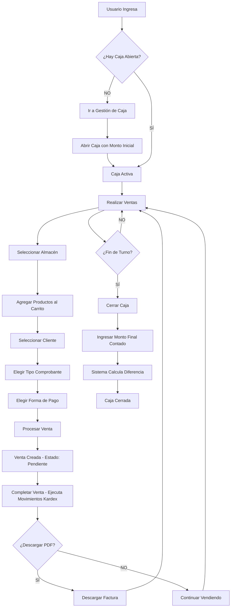

# 📊 Análisis y Rediseño del Módulo de Ventas

**Fecha:** 4 de Noviembre, 2025  
**Autor:** Análisis de Arquitectura  
**Estado:** Propuesta de Rediseño

---

## 🔍 1. ANÁLISIS DE LA SITUACIÓN ACTUAL

### 1.1 Páginas Existentes (Problemas Identificados)

| Página | Ruta | Problemas |
|--------|------|-----------|
| **AperturaCaja.tsx** | `/ventas/apertura-caja` | ❌ Duplica funcionalidad de GestionCaja. Usa API mock deprecada. **ELIMINAR** |
| **GestionCaja.tsx** | `/ventas/gestion-caja` y `/gestion-caja` | ⚠️ Ruta duplicada. Funciona bien con modales de apertura/cierre. **MANTENER Y MEJORAR** |
| **RealizarVenta.tsx** | `/ventas/realizar` | ⚠️ Falta validación de caja abierta en tiempo real. No muestra stock por almacén. **MEJORAR** |
| **ListaVentas.tsx** | `/ventas/lista` | ✅ Recién corregida, falta botón de descarga PDF. **MEJORAR** |

### 1.2 Menú del Sidebar (Actual)

```
📊 Ventas
  ├─ Apertura de caja        ❌ DUPLICADO - Eliminar
  ├─ Gestión Caja            ⚠️ Ruta: /ventas/gestion-caja
  ├─ Realizar Venta          ✅ Mantener
  ├─ Lista de Ventas         ✅ Mantener
  └─ Gestión de Caja         ❌ DUPLICADO - Eliminar (ruta /gestion-caja)
```

### 1.3 Backend API Disponible

```typescript
// Cash Sessions (Sesiones de Caja)
POST   /api/cash-sessions/open               // Abrir caja
POST   /api/cash-sessions/:id/close          // Cerrar caja
GET    /api/cash-sessions                    // Listar sesiones
GET    /api/cash-sessions/active             // Obtener sesión activa

// Sales (Ventas)
POST   /api/sales                             // Crear venta (Pendiente)
PATCH  /api/sales/:id/complete               // Completar venta (ejecuta movimientos)
PATCH  /api/sales/:id/cancel                 // Cancelar venta
GET    /api/sales                             // Listar ventas
GET    /api/sales/:id                         // Detalle venta
GET    /api/sales/:id/invoice/preview        // Vista previa PDF
GET    /api/sales/:id/invoice/download       // Descargar PDF
```

---

## 🎯 2. FLUJO DE NEGOCIO CORRECTO

### 2.1 Flujo Principal de Ventas



### 2.2 Reglas de Negocio

#### Apertura de Caja
- ✅ Solo un usuario puede tener UNA caja abierta a la vez
- ✅ Se registra: fecha/hora apertura, monto inicial, usuario responsable, caja registradora
- ✅ No se pueden realizar ventas sin caja abierta
- ✅ El sistema debe validar en tiempo real si hay caja activa

#### Proceso de Venta
- ✅ **Obligatorio:** Seleccionar almacén ANTES de agregar productos
- ✅ Mostrar solo productos con stock > 0 en el almacén seleccionado
- ✅ Validar stock disponible al agregar/modificar cantidades
- ✅ Cliente es OPCIONAL (si no hay, es "Cliente General")
- ✅ Tipo de comprobante: Boleta, Factura, Nota de Venta
- ✅ Forma de pago: Efectivo, Tarjeta, Transferencia, Yape, Plin
- ✅ **Proceso 2 pasos:**
  1. `createSale()` → Crea venta en estado "Pendiente"
  2. `completeSale()` → Ejecuta movimientos de kardex, actualiza stock, cambia estado a "Completada"

#### Cierre de Caja
- ✅ Se registra: fecha/hora cierre, monto contado, total de ventas
- ✅ Sistema calcula automáticamente: monto esperado = monto inicial + total ventas
- ✅ Sistema muestra diferencia: monto contado - monto esperado
- ✅ Registra diferencia (positiva = sobrante, negativa = faltante)

#### Historial de Ventas
- ✅ Filtros: búsqueda, estado, forma de pago, fecha
- ✅ Ver detalles de cada venta
- ✅ Descargar PDF de factura
- ✅ Vista previa de factura en navegador

---

## 🏗️ 3. PROPUESTA DE REDISEÑO

### 3.1 Estructura de Páginas (SIMPLIFICADA)

```
📁 src/modules/sales/pages/
  ├─ GestionCaja.tsx           ✅ MANTENER - Gestión completa de sesiones
  ├─ RealizarVenta.tsx         ✅ REDISEÑAR - Mejorar validaciones y UX
  ├─ ListaVentas.tsx           ✅ MEJORAR - Agregar acciones de PDF
  └─ DetalleSale.tsx           ➕ NUEVO - Vista detallada de una venta
```

**ELIMINAR:**
- ❌ `AperturaCaja.tsx` (funcionalidad ya está en GestionCaja)

---

## 📄 4. DISEÑO DETALLADO DE CADA PÁGINA

### 4.1 Gestión de Caja (`GestionCaja.tsx`)

**Ruta única:** `/gestion-caja`

#### 🎨 Diseño Visual

```
┌─────────────────────────────────────────────────────────┐
│  🏦 Gestión de Caja                                     │
├─────────────────────────────────────────────────────────┤
│                                                         │
│  ┌─────────────────────────────────────────────────┐  │
│  │  ESTADO ACTUAL                                  │  │
│  │                                                 │  │
│  │  ● Caja Abierta    [Usuario: admin@alexatech]  │  │
│  │  📅 04/11/2025 - 08:30 AM                      │  │
│  │  💰 Monto Inicial: S/ 200.00                   │  │
│  │  📊 Total Ventas: S/ 1,450.00                  │  │
│  │  💵 Esperado: S/ 1,650.00                      │  │
│  │                                                 │  │
│  │  [🔴 Cerrar Caja]                               │  │
│  └─────────────────────────────────────────────────┘  │
│                                                         │
│  ┌─────────────────────────────────────────────────┐  │
│  │  HISTORIAL DE SESIONES                          │  │
│  │                                                 │  │
│  │  🟢 CAJA-001 | 04/11/2025 | S/ 200.00 | Abierta│  │
│  │  🔴 CAJA-001 | 03/11/2025 | S/ 150.00 | Cerrada│  │
│  │     ↳ Diferencia: +S/ 5.00 (Sobrante)         │  │
│  │  🔴 CAJA-001 | 02/11/2025 | S/ 100.00 | Cerrada│  │
│  │     ↳ Diferencia: -S/ 2.50 (Faltante)         │  │
│  └─────────────────────────────────────────────────┘  │
│                                                         │
│  [➕ Abrir Nueva Caja]                                  │
└─────────────────────────────────────────────────────────┘
```

#### 🧩 Componentes

```typescript
// Estado Principal
interface CashSessionState {
  activeCashSession: CashSession | null;
  cashSessions: CashSession[];
  loading: boolean;
  error: string | null;
}

// Componentes Internos
<GestionCaja>
  ├─ <StatusCard>                    // Muestra estado actual
  │   ├─ <SessionInfo />             // Datos de sesión activa
  │   └─ <ActionButton />            // Botón cerrar caja
  │
  ├─ <HistorySection>                // Historial de sesiones
  │   └─ <SessionCard>               // Cada sesión cerrada
  │       ├─ Info básica
  │       ├─ Diferencia calculada
  │       └─ Badge de estado
  │
  ├─ <AperturaModal>                 // Modal para abrir caja
  │   ├─ Select Caja Registradora
  │   ├─ Input Monto Inicial
  │   └─ Botón Confirmar
  │
  └─ <CierreModal>                   // Modal para cerrar caja
      ├─ Resumen de ventas
      ├─ Input Monto Contado
      ├─ Cálculo automático diferencia
      └─ Botón Confirmar Cierre
```

#### ⚙️ Funcionalidades

1. **Al cargar página:**
   - Cargar sesión activa desde backend
   - Cargar historial de sesiones (últimas 10)
   - Si hay sesión activa, actualizar total de ventas en tiempo real

2. **Abrir Caja:**
   - Validar que no haya caja abierta por el usuario
   - Formulario: Seleccionar caja registradora + Monto inicial
   - Llamar `openCashSession(cashRegisterId, montoApertura)`
   - Actualizar estado global

3. **Cerrar Caja:**
   - Mostrar resumen: Monto inicial, Total ventas, Monto esperado
   - Input: Monto contado
   - Calcular diferencia en tiempo real mientras escribe
   - Llamar `closeCashSession(sessionId, montoCierre)`
   - Mostrar mensaje de éxito con diferencia

---

### 4.2 Realizar Venta (`RealizarVenta.tsx`)

**Ruta:** `/ventas/realizar`

#### 🎨 Diseño Visual (2 Columnas)

```
┌────────────────────────────────────────────────────────────────────────┐
│  🛒 Realizar Venta                                                     │
├──────────────────────────────┬─────────────────────────────────────────┤
│  PRODUCTOS DISPONIBLES       │  CARRITO DE COMPRAS                     │
│                              │                                         │
│  🔍 [Buscar producto...]     │  📦 Almacén: [WH-PRINCIPAL ▼]  ⚠️ OBLIG│
│                              │                                         │
│  ┌────────────────────────┐ │  👤 Cliente: [Cliente General ▼]        │
│  │ 💻 Laptop HP           │ │                                         │
│  │ S/ 2,500.00            │ │  📄 Comprobante: [Boleta ▼]            │
│  │ Stock: 5 unidades      │ │  💳 Forma Pago: [Efectivo ▼]           │
│  │ [Agregar al Carrito]   │ │                                         │
│  └────────────────────────┘ │  ─────────────────────────              │
│                              │                                         │
│  ┌────────────────────────┐ │  🛒 PRODUCTOS EN CARRITO:              │
│  │ ⌨️ Teclado Mecánico    │ │                                         │
│  │ S/ 350.00              │ │  • Laptop HP                           │
│  │ Stock: 12 unidades     │ │    S/ 2,500.00 x [2] = S/ 5,000.00    │
│  │ [Agregar al Carrito]   │ │    [-] [2] [+] [🗑️]                    │
│  └────────────────────────┘ │                                         │
│                              │  • Mouse Logitech                      │
│  ┌────────────────────────┐ │    S/ 80.00 x [1] = S/ 80.00          │
│  │ 🖱️ Mouse Logitech      │ │    [-] [1] [+] [🗑️]                    │
│  │ S/ 80.00               │ │                                         │
│  │ Stock: 25 unidades     │ │  ─────────────────────────              │
│  │ [Agregar al Carrito]   │ │                                         │
│  └────────────────────────┘ │  Subtotal:      S/ 5,080.00            │
│                              │  IGV (18%):     S/   914.40            │
│                              │  ═══════════════════════════            │
│                              │  TOTAL:         S/ 5,994.40            │
│                              │                                         │
│                              │  [✅ Procesar Venta]                    │
│                              │  [🗑️ Limpiar Carrito]                  │
└──────────────────────────────┴─────────────────────────────────────────┘
```

#### 🧩 Componentes

```typescript
<RealizarVenta>
  ├─ <LeftPanel> (Productos)
  │   ├─ <SearchBar />              // Búsqueda de productos
  │   ├─ <WarehouseAlert />         // "⚠️ Selecciona almacén primero"
  │   └─ <ProductGrid>
  │       └─ <ProductCard>
  │           ├─ Nombre, precio
  │           ├─ Stock disponible en almacén
  │           └─ Botón "Agregar"
  │
  └─ <RightPanel> (Carrito)
      ├─ <SaleSettings>             // Configuración de venta
      │   ├─ <WarehouseSelector />  ⚠️ OBLIGATORIO
      │   ├─ <ClientSelector />
      │   ├─ <ComprobanteSelector />
      │   └─ <FormaPagoSelector />
      │
      ├─ <CartItems>                // Productos en carrito
      │   └─ <CartItem>
      │       ├─ Nombre, precio unitario
      │       ├─ <QuantityControl /> [-] [input] [+]
      │       ├─ Subtotal
      │       └─ Botón eliminar
      │
      ├─ <TotalsSection>            // Cálculos finales
      │   ├─ Subtotal
      │   ├─ IGV 18%
      │   └─ Total
      │
      └─ <ActionButtons>
          ├─ Procesar Venta
          └─ Limpiar Carrito
```

#### ⚙️ Funcionalidades MEJORADAS

1. **Validación de Caja:**
   ```typescript
   useEffect(() => {
     if (!activeCashSession) {
       // Mostrar alerta y redirigir
       addNotification('error', 'Caja Cerrada', 'Abre una caja para vender');
       navigate('/gestion-caja');
     }
   }, [activeCashSession]);
   ```

2. **Selección de Almacén (NUEVA LÓGICA):**
   - Almacén debe seleccionarse PRIMERO
   - Mientras no haya almacén → Deshabilitar grid de productos
   - Al seleccionar almacén → Filtrar productos con stock > 0 en ese almacén
   - **API:** `GET /api/stock-by-warehouse?almacenId=WH-PRINCIPAL`

3. **Agregar al Carrito:**
   ```typescript
   const addToCart = (product: Product) => {
     if (!selectedWarehouse) {
       addNotification('warning', 'Selecciona Almacén', 'Primero elige un almacén');
       return;
     }
     
     // Obtener stock específico del almacén
     const stockInWarehouse = getStockByWarehouse(product.id, selectedWarehouse);
     
     if (stockInWarehouse <= 0) {
       addNotification('error', 'Sin Stock', 'No hay stock en este almacén');
       return;
     }
     
     // ... lógica actual de agregar
   };
   ```

4. **Proceso de Venta (2 Pasos):**
   ```typescript
   const processSale = async () => {
     try {
       // Paso 1: Crear venta (Pendiente)
       const sale = await createSale(saleData);
       
       // Paso 2: Completar venta (Ejecuta movimientos)
       const completed = await completeSale(sale.id);
       
       // Confirmar descarga de PDF
       if (confirm('¿Descargar factura?')) {
         downloadInvoice(completed.id);
       }
       
       clearCart();
     } catch (error) {
       // Manejo de errores
     }
   };
   ```

---

### 4.3 Lista de Ventas (`ListaVentas.tsx`)

**Ruta:** `/ventas/lista`

#### 🎨 Diseño Visual

```
┌──────────────────────────────────────────────────────────────────┐
│  📋 Historial de Ventas                                          │
├──────────────────────────────────────────────────────────────────┤
│                                                                  │
│  🔍 [Buscar por código o cliente...]                            │
│                                                                  │
│  Filtros: [Todos los Estados ▼] [Todos los Pagos ▼] [Fecha 📅]  │
│           [🗑️ Limpiar Filtros]                                   │
│                                                                  │
│  ┌────────────────────────────────────────────────────────────┐ │
│  │  ESTADÍSTICAS                                              │ │
│  │  📊 Total: 45  💰 S/ 12,500  ✅ Completadas: 42  📊 Prom: S/ 278 │
│  └────────────────────────────────────────────────────────────┘ │
│                                                                  │
│  ┌──────────────────────────────────────────────────────────┐  │
│  │ Código    │ Cliente       │ Fecha    │ Total   │ Estado  │  │
│  ├──────────────────────────────────────────────────────────┤  │
│  │ VEN-001   │ Juan Pérez    │ 04/11/25 │ S/ 2500 │ ✅ Comp │  │
│  │           │ DNI: 12345678 │ 14:30    │ Efectivo│         │  │
│  │           │ Acciones: [👁️ Ver] [📄 PDF] [📥 Descargar]  │  │
│  ├──────────────────────────────────────────────────────────┤  │
│  │ VEN-002   │ María García  │ 04/11/25 │ S/ 1800 │ ✅ Comp │  │
│  │           │ RUC: 20123... │ 13:15    │ Tarjeta │         │  │
│  │           │ Acciones: [👁️ Ver] [📄 PDF] [📥 Descargar]  │  │
│  ├──────────────────────────────────────────────────────────┤  │
│  │ VEN-003   │ Cliente Gral  │ 04/11/25 │ S/ 350  │ 🟡 Pend │  │
│  │           │ -             │ 12:00    │ Yape    │         │  │
│  │           │ Acciones: [✅ Completar] [❌ Cancelar]       │  │
│  └──────────────────────────────────────────────────────────┘  │
│                                                                  │
│  [◄ Anterior]  Página 1 de 5  [Siguiente ►]                     │
└──────────────────────────────────────────────────────────────────┘
```

#### 🧩 Componentes MEJORADOS

```typescript
<ListaVentas>
  ├─ <FilterBar>
  │   ├─ <SearchInput />
  │   ├─ <StatusFilter />
  │   ├─ <PaymentFilter />
  │   ├─ <DatePicker />
  │   └─ <ClearButton />
  │
  ├─ <StatsCards>                   // Tarjetas de estadísticas
  │   ├─ Total de Ventas
  │   ├─ Ingresos Totales
  │   ├─ Ventas Completadas
  │   └─ Venta Promedio
  │
  ├─ <SalesTable>
  │   └─ <SaleRow>
  │       ├─ Código de venta
  │       ├─ Datos de cliente
  │       ├─ Fecha y hora
  │       ├─ Total y forma de pago
  │       ├─ Badge de estado
  │       └─ <ActionButtons>        ➕ NUEVO
  │           ├─ Ver Detalle
  │           ├─ Vista Previa PDF
  │           ├─ Descargar PDF
  │           ├─ Completar (si Pendiente)
  │           └─ Cancelar (si Pendiente)
  │
  └─ <Pagination>
```

#### ⚙️ Funcionalidades NUEVAS

1. **Acciones por Estado:**
   ```typescript
   const getSaleActions = (sale: Sale) => {
     if (sale.estado === 'Pendiente') {
       return [
         <Button onClick={() => completeSale(sale.id)}>✅ Completar</Button>,
         <Button onClick={() => cancelSale(sale.id)}>❌ Cancelar</Button>,
       ];
     }
     
     if (sale.estado === 'Completada') {
       return [
         <Button onClick={() => navigate(`/ventas/detalle/${sale.id}`)}>👁️ Ver</Button>,
         <Button onClick={() => previewInvoice(sale.id)}>📄 Vista Previa</Button>,
         <Button onClick={() => downloadInvoice(sale.id)}>📥 Descargar PDF</Button>,
       ];
     }
     
     return null;
   };
   ```

2. **Vista Previa PDF (Modal):**
   ```typescript
   const handlePreviewPDF = async (saleId: string) => {
     const url = await previewInvoice(saleId); // Retorna blob URL
     window.open(url, '_blank'); // Abre en nueva pestaña
   };
   ```

3. **Descarga Directa:**
   ```typescript
   const handleDownloadPDF = async (saleId: string) => {
     await downloadInvoice(saleId); // Descarga automática
     addNotification('success', 'PDF Descargado', 'Factura guardada');
   };
   ```

---

### 4.4 Detalle de Venta (`DetalleSale.tsx`) ➕ NUEVA PÁGINA

**Ruta:** `/ventas/detalle/:id`

#### 🎨 Diseño Visual

```
┌──────────────────────────────────────────────────────────────────┐
│  📄 Detalle de Venta                          [← Volver a Lista] │
├──────────────────────────────────────────────────────────────────┤
│                                                                  │
│  ┌────────────────────────────────────────────────────────────┐ │
│  │  INFORMACIÓN GENERAL                                       │ │
│  │                                                            │ │
│  │  Código: VEN-20251104-142530                              │ │
│  │  Estado: ✅ Completada                                     │ │
│  │  Fecha: 04/11/2025 - 14:25:30                            │ │
│  │  Usuario: admin@alexatech.com                            │ │
│  │  Caja: CAJA-001                                          │ │
│  └────────────────────────────────────────────────────────────┘ │
│                                                                  │
│  ┌─────────────────────────┐  ┌──────────────────────────────┐ │
│  │  CLIENTE                │  │  COMPROBANTE Y PAGO          │ │
│  │                         │  │                              │ │
│  │  Juan Pérez Sánchez     │  │  Tipo: Boleta                │ │
│  │  DNI: 12345678          │  │  Forma Pago: Efectivo        │ │
│  │  📧 juan@email.com      │  │  Almacén: WH-PRINCIPAL       │ │
│  │  📞 987654321           │  │                              │ │
│  └─────────────────────────┘  └──────────────────────────────┘ │
│                                                                  │
│  ┌────────────────────────────────────────────────────────────┐ │
│  │  PRODUCTOS                                                 │ │
│  │                                                            │ │
│  │  Producto         │ Cant │ P. Unit  │ Subtotal            │ │
│  │  ────────────────────────────────────────────────────────│ │
│  │  Laptop HP        │  2   │ S/ 2,500 │ S/ 5,000.00        │ │
│  │  Mouse Logitech   │  1   │ S/   80  │ S/    80.00        │ │
│  │                                                            │ │
│  │                          Subtotal:     S/ 5,080.00        │ │
│  │                          IGV (18%):    S/   914.40        │ │
│  │                          ─────────────────────────         │ │
│  │                          TOTAL:        S/ 5,994.40        │ │
│  └────────────────────────────────────────────────────────────┘ │
│                                                                  │
│  ┌────────────────────────────────────────────────────────────┐ │
│  │  MOVIMIENTOS DE INVENTARIO                                 │ │
│  │                                                            │ │
│  │  📦 Laptop HP: -2 unidades (WH-PRINCIPAL)                 │ │
│  │     Motivo: VENTA - VEN-20251104-142530                   │ │
│  │                                                            │ │
│  │  📦 Mouse Logitech: -1 unidad (WH-PRINCIPAL)              │ │
│  │     Motivo: VENTA - VEN-20251104-142530                   │ │
│  └────────────────────────────────────────────────────────────┘ │
│                                                                  │
│  [📄 Vista Previa PDF]  [📥 Descargar Factura]                  │
└──────────────────────────────────────────────────────────────────┘
```

#### 🧩 Componentes

```typescript
<DetalleSale>
  ├─ <GeneralInfo />
  │   ├─ Código, Estado, Fecha
  │   └─ Usuario y Caja
  │
  ├─ <ClientInfo />
  │   └─ Datos completos del cliente
  │
  ├─ <InvoiceInfo />
  │   ├─ Tipo comprobante
  │   ├─ Forma de pago
  │   └─ Almacén usado
  │
  ├─ <ProductsTable />
  │   ├─ Lista de items
  │   └─ Totales calculados
  │
  ├─ <InventoryMovements />        ➕ NUEVO
  │   └─ Movimientos de kardex
  │
  └─ <ActionButtons>
      ├─ Vista Previa PDF
      └─ Descargar Factura
```

---

## 🗂️ 5. ACTUALIZACIÓN DEL MENÚ SIDEBAR

### Configuración Simplificada

```typescript
// SidebarContent.tsx - Sección Ventas

<NavItem $isActive={isActive('/gestion-caja') || isActive('/ventas/realizar') || isActive('/ventas/lista')}>
  <a href="#" onClick={(e) => { e.preventDefault(); toggleMenu('ventas'); }}>
    <i className="fas fa-cash-register"></i>
    <span>Ventas</span>
  </a>
  <SubMenu $isOpen={openMenus.ventas}>
    
    <SubMenuItem $isActive={isActive('/gestion-caja')}>
      <Link to="/gestion-caja" onClick={handleItemClick}>
        <i className="fas fa-box-open"></i>
        <h3>Gestión de Caja</h3>
      </Link>
    </SubMenuItem>

    <SubMenuItem $isActive={isActive('/ventas/realizar')}>
      <Link to="/ventas/realizar" onClick={handleItemClick}>
        <i className="fas fa-shopping-cart"></i>
        <h3>Realizar Venta</h3>
      </Link>
    </SubMenuItem>

    <SubMenuItem $isActive={isActive('/ventas/lista')}>
      <Link to="/ventas/lista" onClick={handleItemClick}>
        <i className="fas fa-list-alt"></i>
        <h3>Historial de Ventas</h3>
      </Link>
    </SubMenuItem>

  </SubMenu>
</NavItem>
```

---

## 🔄 6. PLAN DE IMPLEMENTACIÓN

### Fase 1: Limpieza (15 minutos)
- [ ] Eliminar archivo `AperturaCaja.tsx`
- [ ] Eliminar rutas duplicadas en `App.tsx`
- [ ] Actualizar sidebar - Eliminar ítems duplicados
- [ ] Consolidar ruta `/gestion-caja` (quitar `/ventas/gestion-caja`)

### Fase 2: Mejoras en RealizarVenta (45 minutos)
- [ ] Implementar lógica de almacén obligatorio
- [ ] Consultar stock por almacén desde backend
- [ ] Validación de caja abierta en useEffect
- [ ] Deshabilitar productos si no hay almacén seleccionado
- [ ] Mejorar UX de mensajes de validación
- [ ] Agregar loading states

### Fase 3: Mejoras en ListaVentas (30 minutos)
- [ ] Agregar botones de acciones por venta
- [ ] Implementar vista previa PDF (abrir en nueva pestaña)
- [ ] Implementar descarga directa de PDF
- [ ] Agregar acciones según estado (Completar/Cancelar para Pendientes)
- [ ] Mejorar diseño de la tabla
- [ ] Agregar tooltips a botones

### Fase 4: Nueva Página DetalleSale (60 minutos)
- [ ] Crear componente `DetalleSale.tsx`
- [ ] Diseñar layout con cards de información
- [ ] Mostrar datos de venta completos
- [ ] Mostrar productos con totales
- [ ] Mostrar movimientos de inventario asociados
- [ ] Agregar navegación desde ListaVentas
- [ ] Agregar botones de PDF

### Fase 5: Testing E2E (2 horas)
- [ ] Probar flujo completo: Abrir caja → Vender → Descargar PDF → Cerrar caja
- [ ] Validar todos los cálculos
- [ ] Verificar movimientos de inventario
- [ ] Probar filtros y búsquedas
- [ ] Probar PDFs
- [ ] Documentar bugs encontrados

---

## 📊 7. RESUMEN DE CAMBIOS

### ❌ Eliminar
- `AperturaCaja.tsx` - Redundante
- Ruta `/ventas/apertura-caja`
- Ruta `/ventas/gestion-caja`
- Ítem duplicado "Apertura de caja" en sidebar
- Ítem duplicado "Gestión de Caja" en sidebar

### ✅ Mantener y Mejorar
- `GestionCaja.tsx` (ruta `/gestion-caja`)
- `RealizarVenta.tsx` (mejorar validaciones)
- `ListaVentas.tsx` (agregar acciones)

### ➕ Crear
- `DetalleSale.tsx` (ruta `/ventas/detalle/:id`)

### 🎯 Resultado Final

```
Módulo de Ventas (Simplificado)
├─ 3 páginas principales
├─ 1 página de detalle
├─ 0 redundancias
├─ Flujo de negocio completo
└─ UX mejorada
```

---

## 📝 8. VALIDACIONES CRÍTICAS

### Antes de Realizar Venta
✅ Hay caja abierta → Si no → Redirigir a Gestión de Caja  
✅ Almacén seleccionado → Si no → Deshabilitar productos  
✅ Stock disponible en almacén → Si no → No permitir agregar  

### Al Procesar Venta
✅ Carrito no vacío  
✅ Almacén seleccionado  
✅ Cantidades válidas  
✅ 2 pasos: Create → Complete  

### Al Cerrar Caja
✅ Monto contado ingresado  
✅ Confirmación de diferencia  
✅ No quedan ventas pendientes (opcional: warning)  

---

## 🎨 9. PRINCIPIOS DE DISEÑO

1. **Simplicidad:** Menos páginas, más funcionalidad
2. **Claridad:** Estado de caja siempre visible
3. **Validación:** Prevenir errores antes que corregirlos
4. **Feedback:** Notificaciones claras de éxito/error
5. **Consistencia:** Mismos patrones en todo el módulo

---

**FIN DEL ANÁLISIS**

¿Procedemos con la implementación? 🚀
